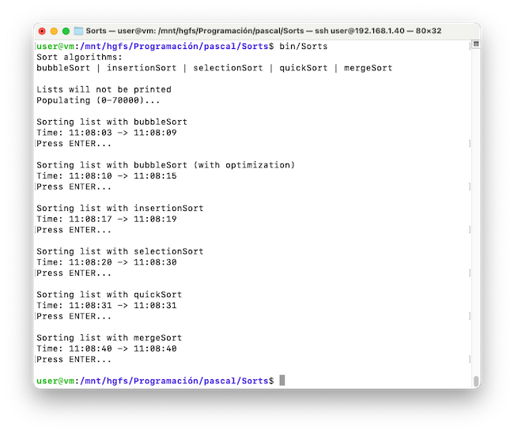

# Sorts

Sorts is a small command line program written in Pascal ISO 10206 (Extended Pascal) that explores different sorting algorithms with a list of randomly generated integers and shows the time taken to perform the sorting.

Sorts implements the following sorting algorithms:
- [Bubble Sort](https://en.wikipedia.org/wiki/Bubble_sort): A simple but inefficient algorithm that works by comparing pairs of elements and swapping them if necessary.
- [Insertion Sort](https://en.wikipedia.org/wiki/Insertion_sort): An efficient algorithm for small or partially sorted lists that builds the sorted list by inserting one element at a time.
- [Selection Sort](https://en.wikipedia.org/wiki/Selection_sort): A simple algorithm that finds the minimum element and places it at the beginning in each iteration.
- [Quick Sort](https://en.wikipedia.org/wiki/Quicksort): A divide-and-conquer algorithm that selects a pivot element and organizes the elements around it.
- [Merge Sort](https://en.wikipedia.org/wiki/Merge_sort): Another divide-and-conquer algorithm that splits the list into halves, sorts each half, and then merges the two sorted halves.

Additionally, the text file `Sorts.conf` allows configuring the size of the list (default is 100 elements) and whether to display the list before and after sorting with each algorithm (by writing the words `TRUE` or `FALSE`).

By observing the execution results, we can see that each algorithm has its own performance and efficiency in different situations. The choice of the appropriate algorithm depends on the size of the list and the distribution of the data.

## How to use it
Compile using:

	$ make all

Then execute:

	$ bin/Sorts

## Configuration
Parameters are set inside 'Sorts.conf' text file:
- SIZE: sets the size of the list to be sorted
- PRINT_LISTS: determines if the program should print initial and sorted lists with every algorithm

If you want to set PRINT_LISTS to TRUE, then set SIZE to a smaller value (i.e.: 25);

If configuration file can't be accesed, default values are:
100
TRUE

## Compilation
Uses GNU Pascal compiler:

	$ make all

Clean files:

	$ make clean
